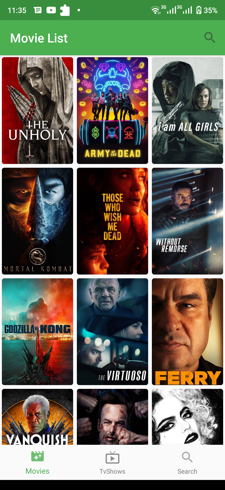
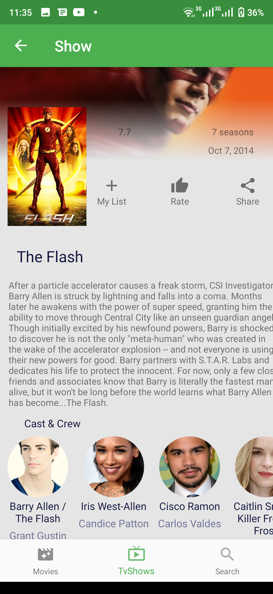
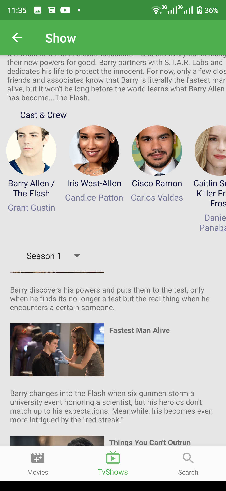

# Movie APP(🚧 under construction)

Android application that consumes themoviedb API(https://www.themoviedb.org/documentation/api).
Lists movies and tv shows according to the users sorting choice.
Technology used:
Android Jetpack
        Retrofit
        MVVM
        Glide
        BottomNavigation

## Screenshots

  